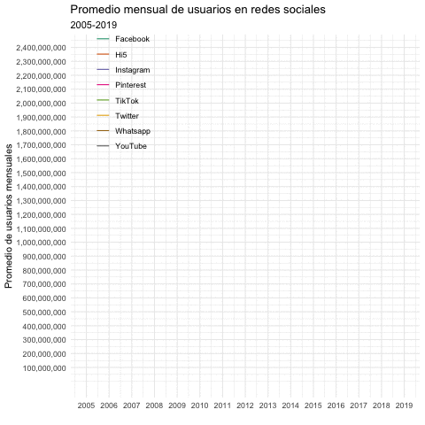

<style type="text/css">

.navbar {
  background-color: #3BC9D9;
  font-family: 'lato', sans-serif;  
  font-size: 20px;
}

.navbar-brand {
  background-color: #04588C;
  font-family: 'lato', sans-serif;
  font-size: 20px;
}

.navbar-logo img {
   width: 40px;
   position: absolute;
   right: 0px;
   margin: 10px;
}

body {
  background-color: #04588C;
}

.chart-title {
  font-family: 'lato', sans-serif;
  font-size: 30px;
  color: #0468BF;
}

.chart-shim{
 color: #blue;
}
.color1 {
  background-color: #04588C; 
}
.color2 {
  background-color: #04588C; 
}
.color3 {
  background-color: #04588C; 
}
</style>


```{r echo=FALSE}
library(ggplot2)
library(waffle)
library(haven)
library(dplyr)
library(janitor)
library(kableExtra)
library(skimr)
library(ggthemes)
library(ggfittext)
library(dplyr)
library(plotly)
library(forcats)
library(DT)
library(gganimate)
library(tidyverse)
library(udpipe)
library(magick)
library(cowplot)
library(RColorBrewer)
library(shinydashboard)
library(htmlwidgets)
library(flexdashboard)

```

```{r echo=FALSE}
db1 <- read.csv("WhatsgoodlyData-6.csv")

```


```{r echo=FALSE}
#Primero realizamos la lectura de la base de datos
UBSM <- read.csv("ubsmp.csv")
#Guardamos la tabla como un rds
saveRDS(UBSM, "UBSM.rds")
#Convertimos nuestra tabla en un dataframe

df <- as.data.frame(UBSM)
```

```{r echo=FALSE}
#Primero realizamos la lectura de la base de datos
WGDG <- read.csv("WGDG.csv")
#Guardamos la tabla como un rds
saveRDS(WGDG, "WGDG.rds")
#Convertimos nuestra tabla en un dataframe
dframe <- as.data.frame(WGDG)
```


Inicio
=====================================  


Redes Sociales más usadas
=====================================    
Column {data-width=1000}
-------------------------------------
    
### Promedio mensual de usuarios en Redes Sociales

```{r}

```    
```{r}

df %>% filter(Entity %in% c("Facebook", "Instagram", "Twitter", "YouTube")) %>%
  ggplot(aes(x = Year, y = Monthly.active.users)) +
  geom_line(aes(color = Entity), size=0.5)+
  scale_x_continuous(breaks = seq(2006, 2019, 1),
                     labels = seq(2006, 2019, 1))+
  scale_y_continuous(breaks = seq(100000000, 10000000000, 100000000),
                     labels = scales::comma)+
  scale_color_brewer(name = NULL, type = "qual", palette = "PuBu")+
  labs(title = "Entre el 2008 y el 2020",
       subtitle = "en Estados Unidos",
       caption = "Fuente: Diplomado de R para estadística",
       x = NULL,
       y = "Promedio de usuarios mensuales") +
  theme_light(base_size = 5) +
  theme(legend.position = c(0.15, 0.80))

```

```{r}

```
   
Column {data-width=400}
-------------------------------------
   
### Chart 2

```{r eval=FALSE, include=FALSE}
UBSM %>% filter(Entity %in% c("Facebook", "Hi5", "Instagram", "Pinterest", "TikTok", "Twitter", "Whatsapp", "YouTube")) %>%
  ggplot(aes(x = Year, y = Monthly.active.users)) +
  geom_line(aes(color = Entity), size=0.5)+
  scale_x_continuous(breaks = seq(2005, 2020, 1),
                     labels = seq(2005, 2020, 1))+
  scale_y_continuous(breaks = seq(100000000, 10000000000, 100000000),
                     labels = scales::comma)+
  scale_color_brewer(name = NULL, type = "qual", palette = "Dark2")+
  labs(title = "Promedio mensual de usuarios en redes sociales",
       subtitle = "2005-2019",
       caption = NULL,
       x = NULL,
       y = "Promedio de usuarios mensuales") +
  theme_minimal() +
  theme(legend.position = c(0.15, 0.85)) +
  transition_reveal(Year)
```   
 
### Chart 3
    
```{r}
valueBox(10)
```

Influencia de las redes sociales {data-orientation=rows}
=====================================     
   
Row {data-height=600}
-------------------------------------

### ¿Influye en las mujeres el uso de las redes sociales en la desición en las compras?

```{r}
WGDG %>% filter(Segment.Description == "Female voters") %>% count(Answer) %>% 
  mutate(Answer = fct_rev(fct_reorder(Answer, n, .desc = TRUE))) %>% 
  plot_ly(x = ~n, y = ~Answer, hoverinfo = "x", text = ~n) %>% 
  add_bars(color = I("#056099")) %>% 
  layout(xaxis = list(title = "Cantidad de mujeres que votaron",
                      zeroline = FALSE,
                      range = c(0,600)),
         yaxis = list(title = "Red social",
                      ticklen = 5,
                      tickcolor = "transparent"))
```

Row {data-height=400}
-------------------------------------
   
### Chart 2

```{r}

```   
    
### Chart 3


```{r}

```